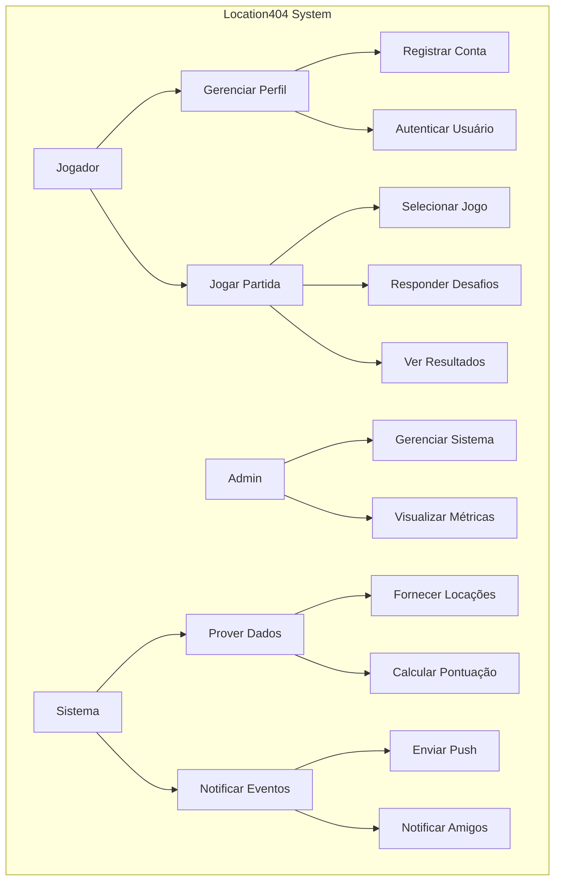

# Capa
- **Título do Projeto**: Location404 - Plataforma de Geolocalização em Tempo Real
- **Nome do Estudante**: Ryan Gabriel Mazzei Bromati
- **Curso**: Engenharia de Software
<!-- - **Data de Entrega**: [Data] -->

# Resumo

Este documento apresenta a especificação técnica para o desenvolvimento do Location404, uma plataforma de geolocalização interativa inspirada no conceito do GeoGuessr. O projeto utiliza uma arquitetura de microsserviços com C# .NET 9+ e Angular 18+, permitindo escalabilidade, alta disponibilidade e separação clara de responsabilidades. O Location404 oferecerá uma experiência imersiva onde usuários poderão testar seus conhecimentos geográficos em cenários diversos, competir com outros jogadores, e participar de desafios temáticos, tudo sustentado por uma infraestrutura robusta de serviços distribuídos.

## 1. Introdução

### Contexto
O mercado de jogos geográficos online tem crescido significativamente nos últimos anos, com plataformas como GeoGuessr ganhando popularidade tanto para entretenimento quanto para fins educacionais. Nesse contexto, o Location404 surge como uma alternativa moderna que busca explorar as mais recentes tecnologias de desenvolvimento web e arquiteturas distribuídas para oferecer uma experiência superior ao usuário.

### Justificativa
O projeto Location404 é relevante para o campo da engenharia de software pois implementa conceitos avançados de arquitetura distribuída em um cenário prático e atrativo. A adoção de microsserviços em um jogo de geolocalização permite explorar desafios reais de desenvolvimento de software, como latência em comunicações distribuídas, persistência de dados, escalabilidade em momentos de pico de uso, e segurança em um ambiente altamente interativo. Além disso, o projeto demonstra a aplicação prática de padrões arquiteturais modernos e tecnologias de ponta.

### Objetivos

**Objetivo Principal:**
Desenvolver uma plataforma de jogo de geolocalização completa, baseada em microsserviços, que ofereça desempenho superior, alta disponibilidade e uma experiência de usuário envolvente.

**Objetivos Secundários:**
- Implementar uma arquitetura de microsserviços escalável e resiliente
- Criar uma interface de usuário responsiva e intuitiva com Angular 18+
- Desenvolver um sistema de autenticação seguro e eficiente
- Estabelecer mecanismos de notificação em tempo real para eventos do jogo
- Implementar um sistema preciso de geolocalização e cálculo de pontuação
- Criar uma infraestrutura de dados que permita expansão futura do jogo
- Desenvolver um sistema básico de competição e ranking entre jogadores

## 2. Descrição do Projeto

### Tema do Projeto
O Location404 é uma plataforma de jogo online que desafia os usuários a identificar localizações geográficas com base em imagens de satélite, fotos panorâmicas de ruas, e outros recursos visuais. Utilizando dados geográficos precisos, o jogo transporta os jogadores para diversos locais ao redor do mundo, testando seu conhecimento em geografia, culturas, paisagens urbanas e naturais.

O projeto adota uma arquitetura de microsserviços para garantir escalabilidade e manutenibilidade, utilizando C# .NET 9+ para o backend e Angular 18+ para o frontend. Cada componente do sistema é isolado em seu próprio serviço, comunicando-se através de interfaces bem definidas, facilitando a evolução independente e a resiliência do sistema.

### Problemas a Resolver

1. **Latência e Responsividade**: Garantir tempos de resposta rápidos mesmo com processamento distribuído entre microsserviços.
2. **Escalabilidade**: Suportar picos de tráfego durante eventos ou horários de alta demanda.
3. **Integridade de Dados**: Manter a consistência dos dados do jogo e perfis de usuário entre serviços distribuídos.
4. **Segurança**: Proteger dados sensíveis dos usuários e evitar trapaças no sistema de jogo.
5. **Disponibilidade**: Garantir que o sistema permaneça operacional mesmo quando partes específicas estejam em manutenção.
6. **Experiência do Usuário**: Oferecer uma interface fluida e intuitiva apesar da complexidade da infraestrutura.
7. **Integração de Dados Geográficos**: Incorporar fontes de dados geográficos precisos e atualizados.

### Limitações

- O projeto não abordará a criação ou captura de imagens geográficas próprias, utilizando integrações com APIs de terceiros.
- O sistema será inicialmente otimizado apenas para plataforma web (desktop e móvel), sem aplicativos nativos para dispositivos móveis.
- A cobertura geográfica inicial poderá ser limitada com base na disponibilidade de dados de qualidade.
- O projeto não incluirá múltiplos modos de jogo na versão inicial, focando apenas no modo padrão.
- O sistema não implementará um sistema de troféus e conquistas nesta versão.
- Não haverá suporte inicial para criação de desafios personalizados pelos usuários.

## 3. Especificação Técnica

### 3.1. Requisitos de Software

#### Lista de Requisitos

**Requisitos Funcionais (RF):**

1. **RF01** - O sistema deve permitir cadastro de novos usuários com email e senha ou Google.
2. **RF02** - O sistema deve autenticar usuários registrados.
3. **RF03** - O sistema deve permitir que usuários iniciem uma nova partida.
4. **RF04** - O sistema deve apresentar localizações aleatórias ou temáticas para os jogadores.
5. **RF05** - O sistema deve calcular a pontuação baseada na proximidade da resposta do jogador à localização real.
6. **RF06** - O sistema deve armazenar histórico de partidas dos usuários.
7. **RF07** - O sistema deve permitir a criação de rankings globais e por categorias.
8. **RF08** - O sistema deve enviar notificações de novos desafios e convites.
9. **RF09** - O sistema deve permitir que usuários adicionem amigos e os desafiem para partidas.
10. **RF11** - O sistema deve permitir que usuários visualizem e editem seu perfil.
11. **RF14** - O sistema deve integrar dados geográficos de múltiplas fontes.

**Requisitos Não-Funcionais (RNF):**

1. **RNF01** - O sistema deve responder a interações do usuário em menos de 700ms.
2. **RNF02** - O sistema deve suportar pelo menos 1.000 usuários simultâneos.
3. **RNF04** - O sistema deve proteger dados sensíveis de usuários com criptografia.
4. **RNF05** - O sistema deve ser compatível com os principais navegadores (Chrome, Firefox, Safari, Edge).
5. **RNF07** - O sistema deve resistir a ataques comuns (XSS, CSRF, injeção SQL).
6. **RNF08** - As APIs devem ser RESTful com documentação Scalar/OpenAPI.
7. **RNF09** - O sistema deve implementar um mecanismo de fallback quando serviços específicos estiverem indisponíveis.
8. **RNF10** - O sistema deve implementar observabilidade com logs, métricas e traces.
9. **RNF11** - O sistema deve garantir integridade transacional entre microsserviços.
10. **RNF12** - O sistema deve implementar rate limiting para prevenir abusos.
11. **RNF13** - O sistema deve usar cache para otimizar requisições recorrentes.
12. **RNF14** - O sistema deve possuir cobertura de testes automatizados de pelo menos 80%.

#### Representação dos Requisitos

**Diagrama de Casos de Uso (UML)**



### 3.2. Considerações de Design

#### Visão Inicial da Arquitetura

O Location404 seguirá uma arquitetura de microsserviços, com os seguintes componentes principais:

1. **Location404-User-Identity-Service**: Gerenciamento de identidade e autenticação
2. **Location404-API-Gateway**: Ponto de entrada único e roteador para outros serviços
3. **Location404-Notification-Hub**: Sistema centralizado de notificações
4. **Location404-GameCore-Engine**: Lógica central de jogabilidade
5. **Location404-GeoData-Service**: Fornecimento de dados geográficos

Cada microsserviço será independente, com seu próprio banco de dados, e comunicará com outros serviços por meio de APIs RESTful e mensageria assíncrona. O API Gateway atua como ponto central de entrada, enquanto o frontend Angular 18+ consumirá dados através deste gateway.

#### Padrões de Arquitetura

- **Microsserviços**: Arquitetura principal, permitindo desenvolvimento, implantação e escalabilidade independentes.
- **API Gateway**: Para rotear requisições aos serviços apropriados e simplificar o acesso do cliente.
- **CQRS (Command Query Responsibility Segregation)**: Para separar operações de leitura e escrita em alguns serviços.
- **Event-Driven Architecture**: Para comunicação assíncrona entre serviços usando mensageria.
- **Repository Pattern**: Para abstração da camada de persistência.
- **Clean Architecture**: Para organização interna de cada microsserviço.
- **BFF (Backend for Frontend)**: Para otimizar APIs específicas para o cliente web.

#### Modelos C4

**Modelo C4: ... a fazer**


### 3.3. Stack Tecnológica

#### Linguagens de Programação

- **C# 12 (.NET 9+)**: Escolhido para o desenvolvimento do backend devido à sua robustez, desempenho e excelente suporte a aplicações empresariais. O .NET 9 traz recursos avançados de performance e produtividade para microsserviços.
  
- **TypeScript 5.2+**: Para o desenvolvimento frontend com Angular 18+, proporcionando segurança de tipo e recursos avançados de linguagem que melhoram a qualidade do código e a experiência de desenvolvimento.

- **SQL**: Para consultas em bancos de dados relacionais.

- **Lua**: Para scripts de automação no desenvolvimento.

#### Frameworks e Bibliotecas

**Backend:**

- **.NET 9+**: Framework base para todos os microsserviços.
- **ASP.NET Core 9+**: Para desenvolvimento de APIs RESTful.
- **Entity Framework Core 9+**: ORM para acesso a dados.
- **Identity Server**: Para autenticação e autorização.
- **MediatR**: Para implementação do padrão mediator.
- **Ocelot**: Para implementação do API Gateway.
- **AutoMapper**: Para mapeamento entre entidades e DTOs.
- **FluentValidation**: Para validação de dados.
- **Polly**: Para implementação de políticas de resiliência.
- **SignalR**: Para comunicação em tempo real.
- **Serilog**: Para logging estruturado.
- **Scalar/OpenAPI**: Para documentação de API.
- **xUnit, Moq, FluentAssertions**: Para testes automatizados.

**Frontend:**

- **Angular 18+**: Framework principal para o frontend.
- **RxJS**: Para programação reativa.
- **NgRx**: Para gerenciamento de estado.
- **Angular Material**: Para componentes de UI.
- **Leaflet/MapboxGL**: Para visualização de mapas.
- **Chart.js**: Para visualização de dados e estatísticas.
- **TailwindCSS**: Para estilização.
- **Jest e Cypress**: Para testes unitários e end-to-end.

**Infraestrutura e DevOps:**

- **Docker e Kubernetes**: Para containerização e orquestração.
- **Redis**: Para cache distribuído.
- **PostgreSQL**: Como banco de dados principal.
- **MongoDB**: Para armazenamento de dados geoespaciais.
- **RabbitMQ/Kafka**: Para mensageria entre serviços.
- **Prometheus e Grafana**: Para monitoramento e alertas.
- **GitHub Actions**: Para CI/CD.

#### Ferramentas de Desenvolvimento e Gestão de Projeto

- **Rider**: IDE principal para desenvolvimento backend.
- **Visual Studio Code**: IDE para desenvolvimento frontend.
- **GitHub**: Para controle de versão e gerenciamento do projeto.
- **Confluence**: Para documentação técnica e de produto.
- **JMeter/K6**: Para testes de carga.

### 3.4. Considerações de Segurança

O Location404 implementará várias medidas de segurança para proteger dados de usuários e a integridade do sistema:

1. **Autenticação e Autorização**:
   - Implementação de OAuth 2.0/OpenID Connect para autenticação segura.
   - Integração com login do Google.
   - JWT (JSON Web Tokens) com tempo de expiração curto.
   - Refresh tokens com rotação para sessões longas.
   - RBAC (Role-Based Access Control) para diferentes níveis de acesso.

2. **Proteção de Dados**:
   - Criptografia de dados sensíveis em trânsito (TLS 1.3) e em repouso.
   - Implementação de hashing seguro para senhas.
   - Armazenamento mínimo de dados pessoais (data minimization).
   - Anonimização de dados para análises internas.

3. **Segurança da API**:
   - Implementação de CORS configurado corretamente.
   - Proteção contra ataques comuns: XSS, CSRF, SQL Injection.
   - Rate limiting e throttling para prevenir abusos.
   - Validação estrita de entradas de usuário.

4. **Segurança da Infraestrutura**:
   - Segmentação de rede entre microsserviços.
   - Princípio de privilégio mínimo para serviços e contêineres.
   - Escaneamento regular de vulnerabilidades.
   - Atualizações de segurança automatizadas.

5. **Detecção e Resposta**:
   - Logging abrangente de eventos de segurança.
   - Monitoramento de anomalias em tempo real.

6. **Segurança Específica do Jogo**:
   - Validação server-side de todas as ações de jogo.
   - Separação de lógica crítica no backend, não exposta ao cliente.

## 4. Próximos Passos

### Cronograma de Desenvolvimento

| Mês          | Atividades                                                                                                                                                       |
| ------------ | ---------------------------------------------------------------------------------------------------------------------------------------------------------------- |
| **Maio**     | - Finalização e aprovação do RFC<br>- Setup do ambiente de desenvolvimento e CI/CD<br>- Início do desenvolvimento do Location404-Auth-Service                    |
| **Junho**    | - Implementação do núcleo do Location404-Auth-Service (autenticação com email)<br>- Integração com autenticação Google<br>- Testes e refinamento do Auth-Service |
| **Julho**    | - Desenvolvimento do Location404-API-Gateway<br>- Setup inicial do frontend Angular e primeiras integrações                                                      |
| **Agosto**   | - Início do desenvolvimento do GameCore-Engine (lógica básica de jogo)<br>- Desenvolvimento da interface de usuário para jogabilidade básica                     |
| **Setembro** | - Integração com serviços de dados geográficos (GeoData-Service)<br>- Implementação do sistema de pontuação e rankings básicos                                   |
| **Outubro**  | - Desenvolvimento do Notification-Hub<br>- Implementação de funcionalidades sociais (amigos, desafios)                                                           |
| **Novembro** | - Testes de sistema e otimizações de performance<br>- Refinamento da UX/UI e correções de bugs                                                                   |
| **Dezembro** | - Finalização do MVP, testes finais e documentação<br>- Preparação para apresentação e entrega final                                                             |


## 5. Referências

- Microsoft. .NET 9 Documentation. https://docs.microsoft.com/en-us/dotnet/
- Angular Team. Angular 18 Documentation. https://angular.io/docs
- OWASP. Web Security Testing Guide. https://owasp.org/www-project-web-security-testing-guide/
- Google Maps Platform. API Documentation. https://developers.google.com/maps/documentation
- OpenStreetMap. API Documentation. https://wiki.openstreetmap.org/wiki/API

## 6. Apêndices

### Apêndice A: Glossário de Termos

- **Microsserviços**: Estilo arquitetural onde o aplicativo é composto de pequenos serviços autônomos.
- **API Gateway**: Componente que serve como ponto de entrada único para todos os clientes.
- **JWT (JSON Web Token)**: Padrão aberto para criação de tokens de acesso.
- **CQRS**: Padrão que separa operações de leitura e escrita.
- **Event-Driven Architecture**: Paradigma de design focado na produção, detecção e reação a eventos.
- **CI/CD**: Continuous Integration/Continuous Deployment, práticas de automação de integração e entrega.

### Apêndice B: Estimativa de Recursos

#### Infraestrutura Inicial
- 3-5 nós Kubernetes para ambiente de produção
- Banco de dados PostgreSQL gerenciado
- Cache Redis distribuído 
- Sistema de mensageria RabbitMQ

## 7. Avaliações de Professores

### Considerações Professor/a:
```


```

### Considerações Professor/a:
```


```

### Considerações Professor/a:
```


```