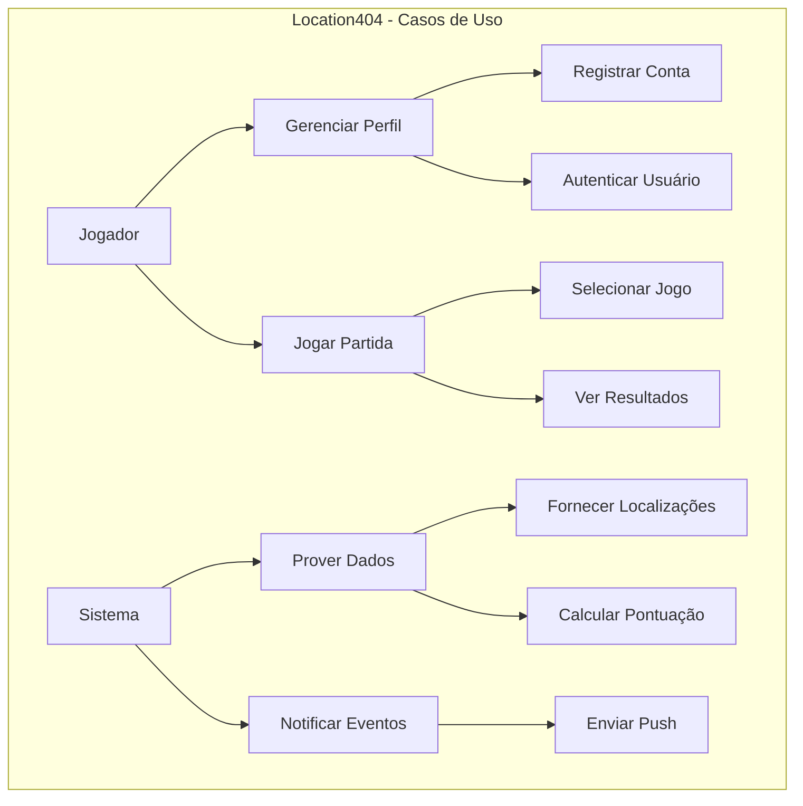

```mermaid
graph TD
    subgraph "Location404 - Casos de Uso"
        Player[Jogador]
        System[Sistema]
        
        Player --> ManageProfile[Gerenciar Perfil]
        Player --> PlayGame[Jogar Partida]
        
        ManageProfile --> Register[Registrar Conta]
        ManageProfile --> Auth[Autenticar Usuário]
        
        PlayGame --> SelectGame[Selecionar Jogo]
        PlayGame --> ViewResults[Ver Resultados]
        
        System --> ProvideData[Prover Dados]
        System --> NotifyEvents[Notificar Eventos]
        
        ProvideData --> ProvideLocations[Fornecer Localizações]
        ProvideData --> CalculateScore[Calcular Pontuação]
        
        NotifyEvents --> SendPush[Enviar Push]
    end
```